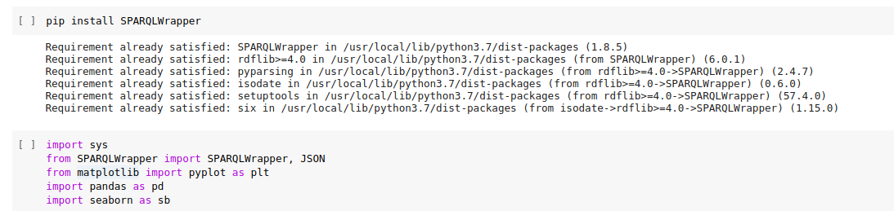

# Querying Wikipedia using SPARQL

* Solution to the assignment problem given to me about SPARQL

* Question 1
  * `List all the countries of the European Union along with their population. Also, plot a graph of Population vs Country.`

* Solution 1

  * part 1

    * 
    * 
    * 
    * The link to result csv file [csv](data.csv)
    
  * part 2
  
    *  
    * 

* Question 2

  * `List the cities of the European Union with female mayors.`
  
* Solution 2
  * 
  * 
    * Resultant CSV file [Female Mayors](mayors.csv)